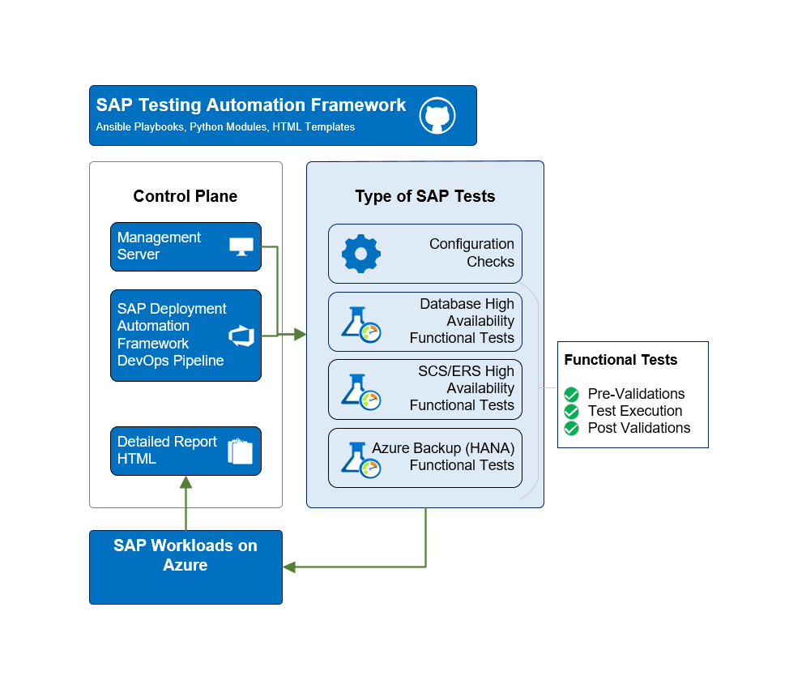

# SAP Testing Automation Framework

## 🔍 Overview

The SAP Testing Automation Framework is an open-source orchestration tool designed to validate SAP deployments on Microsoft Azure. It enables you to assess system configurations against SAP on Azure best practices and guidelines, and facilitates automation for various testing scenarios.

## 📊 Key Scenarios

SAP Testing Automation is designed as a scalable framework to orchestrate and validate a wide spectrum of SAP landscape scenarios through repeatable, policy-driven test modules. The framework currently offers following scenarios -

> [!NOTE]
>
> The High Availability testing scenario in the SAP Testing Framework is **generally available (GA)**, while the Configuration Checks and Azure Backup Testing scenarios are currently in **public preview**.

### Configuration Checks (Preview)

The fastest way to validate your SAP system — run against any SAP deployment (HA or non-HA, Linux or Windows) with no prerequisites beyond SSH/WinRM connectivity and Azure managed identity.

The framework performs comprehensive configuration checks to ensure that the SAP system and its components are set up according to [SAP on Azure best practice](https://learn.microsoft.com/azure/sap/). This includes validating infrastructure settings, operating system parameter configurations, and network settings, in addition to the cluster configuration, to identify any deviations that could impact system performance or reliability.

- **Infrastructure Validation:** This includes validating the underlying infrastructure components, such as virtual machines, load balancer, and other resource configurations, to ensure they meet the requirements for running SAP workloads on Azure.
- **Storage Configuration Checks:** It validates settings of disks, storage accounts, Azure NetApp Files, including throughput, performance, and stripe size.
- **Operating System and SAP Parameter Validation:** The framework checks critical operating system parameters and SAP kernel settings to ensure they align with recommended configurations.
- **Cluster Configuration Validation:** This framework ensures that the high availability cluster resource settings adhere to best practices for high availability and failover scenarios.

### High Availability Testing

In the SAP Testing Automation Framework, thorough validation of high availability SAP HANA (scale-up and scale-out HSR) and SAP Central Services failover mechanisms in pacemaker clusters can be performed, ensuring the system operates correctly across different situations.

- **High Availability Configuration Validation:** The framework helps to ensure that SAP HANA (scale-up and scale-out HSR) and SAP Central Services configurations and load balancer settings are compliant with SAP on Azure high availability configuration guidelines.
- **Functional Testing:** The framework executes series of real-world scenarios based on the SAP HANA and SAP Central Services high availability setup to identify potential issues, whether during a new system deployment or before implementing cluster changes in a production environment. The test cases are based on what is documented in how-to guides for SAP HANA and SAP Central Services configuration.
- **Offline configuration validation:** Offline validation is a mode of the framework that validates SAP HANA and SAP Central Services high availability cluster configurations without establishing a live SSH connection to the production cluster. Instead, it analyzes captured cluster information base (CIB) XML files exported from each cluster node.

### Azure Backup Testing (Preview)

The framework validates Azure Backup operations for SAP HANA databases, covering the full backup-restore lifecycle. It supports both HA (two-node cluster) and non-HA (single-node) deployments.

- **Backup Setup Verification:** Discovers protected HANA databases in the Recovery Services vault, verifies backup configuration health, and checks that recent restore points exist.
- **Restore Operations:** Tests restore-to-database (in-place and cross-VM) and restore-to-filesystem workflows via the Azure Backup Python SDK, monitoring restore jobs to completion.
- **Database Recovery Validation:** Validates native HANA recovery using database commands (`RECOVER DATA`), and confirms the database is consistent and operational after each restore.

The framework generates comprehensive reports, highlighting configuration mismatch or deviations from recommended best practices. For high availability scenarios, the report includes failover test outcomes, any failures encountered, and logs with insights to aid in troubleshooting identified issues.

## 🏆 Purpose

Testing is crucial for keeping SAP systems running smoothly, especially for critical business operations. This framework helps by addressing key challenges:

- **Risk Prevention** - The high availability testing helps simulate system failures like node crashes, network issues, and storage failures to check if recovery mechanisms work properly, helping to catch problems before they affect real operations. Configuration validation detects misalignments with SAP on Azure best practices early.
- **Compliance Requirements** - Many businesses need to prove their SAP systems are reliable. This framework provides detailed reports and logs that help with audits and ensure compliance with internal and regulatory standards.
- **Quality Assurance** - The framework runs automated tests to verify whether the failover behavior of SAP components functions as expected on Azure across various test scenarios. It also ensures that the cluster and resource configurations are set up correctly, helping to maintain system reliability.
- **Test Automation** - Manually validating overall SAP systems' configurations and high availability (HA) setup is slow and error-prone. This framework automates the process, from setup to reporting, saving time and ensuring more accurate and consistent results.

## 🏗️ Architecture and Components

To learn how the framework works, refer to the [architecture and components](./docs/ARCHITECTURE.md) documentation.

## 🚦 Get Started

There are three ways to use the SAP Testing Automation Framework:

### Option 1: AI Assistant Plugins (Recommended) &nbsp; 

The fastest path — install a plugin in your AI coding assistant and let it handle environment setup, test execution, and result analysis interactively with natural language.

| Platform | Install |
|----------|---------|
| GitHub Copilot CLI | `copilot plugin install Azure/sap-automation-qa` |
| Claude Code | `/plugin marketplace add Azure/sap-automation-qa` → `/plugin install staf@sap-automation-qa` |
| Gemini CLI | `gemini skills install https://github.com/Azure/sap-automation-qa` |

The plugin provides guided skills for workspace creation, configuration validation, HA test execution, and result analysis. See [docs/PLUGINS.md](./docs/PLUGINS.md) for full details.

### Option 2: Standalone Setup of SAP Testing Automation Framework

 Standalone Setup of SAP Testing Automation Framework

For users focused solely on validating SAP functionality and configurations, the standalone approach offers a streamlined process to test critical SAP components without the complexity of full deployment integration. For more details on the setup, see following documents to get started -

For full setup details including workspace configuration, credential management, and managed identity setup, see [Setup Guide](./docs/SETUP.MD).

- [High Availability Testing](./docs/HIGH_AVAILABILITY.md)
- [Azure Backup Testing](./docs/AZURE_BACKUP.md)
- [Configuration Checks](./docs/CONFIGURATION_CHECKS.md)

### Option 3: Integration with SAP Deployment Automation Framework (SDAF)

If you already have an [SAP Deployment Automation Framework](https://learn.microsoft.com/azure/sap/automation/deployment-framework) environment set up, integrating the SAP Testing Automation Framework is a natural extension that allows you to leverage existing deployment pipelines and configurations. For more details on the setup, see [Setup Guide](./docs/SETUP.MD).

## 🆘 Support

For support and questions, please:

1. Check [existing issues](https://github.com/Azure/sap-automation-qa/issues/)
2. Ask questions or start a conversation in [GitHub Discussions](https://github.com/Azure/sap-automation-qa/discussions)
3. Create a new issue if needed and provide detailed information about the problem

## 📚 Additional Resources

- [AI Assistant Plugins Guide](./docs/PLUGINS.md)
- [Architecture and Components](./docs/ARCHITECTURE.md)
- [Azure Backup Testing Guide](./docs/AZURE_BACKUP.md)
- [Azure SAP Documentation](https://docs.microsoft.com/azure/sap)
- [Changelog](./docs/CHANGELOG.md)
- [Configuration Checks Guide](./docs/CONFIGURATION_CHECKS.md)
- [High Availability Testing Guide](./docs/HIGH_AVAILABILITY.md)
- [Setup Guide](./docs/SETUP.MD)

## 🤝 Contributing

This project welcomes contributions and suggestions.  Most contributions require you to agree to a Contributor License Agreement (CLA) declaring that you have the right to, and actually do, grant us the rights to use your contribution. For details, visit <https://cla.opensource.microsoft.com>.

When you submit a pull request, a CLA bot will automatically determine whether you need to provide a CLA and decorate the PR appropriately (e.g., status check, comment). Simply follow the instructions provided by the bot. You will only need to do this once across all repos using our CLA.

This project has adopted the [Microsoft Open Source Code of Conduct](https://opensource.microsoft.com/codeofconduct/). For more information see the [Code of Conduct FAQ](https://opensource.microsoft.com/codeofconduct/faq/) or contact [opencode@microsoft.com](mailto:opencode@microsoft.com) with any additional questions or comments.

## ⚖️ Legal

### License

> Copyright (c) Microsoft Corporation. Licensed under the MIT License.

### Trademarks

This project may contain trademarks or logos for projects, products, or services. Authorized use of Microsoft trademarks or logos is subject to and must follow [Microsoft's Trademark & Brand Guidelines](https://www.microsoft.com/en-us/legal/intellectualproperty/trademarks/usage/general). Use of Microsoft trademarks or logos in modified versions of this project must not cause confusion or imply Microsoft sponsorship. Any use of third-party trademarks or logos are subject to those third-party's policies.
